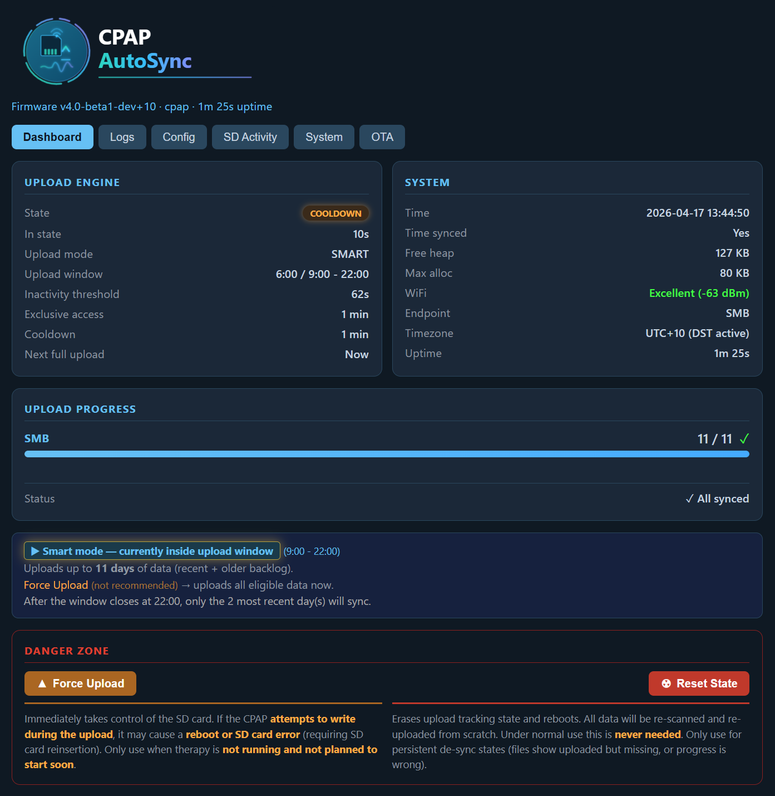

# ESP32 CPAP AutoSync

Automatically upload CPAP therapy data from your SD card to a network share or SleepHQ — **within minutes of taking your mask off.**

Built with **extreme ease of use** in mind:
- 😎 **No coding required**: Flash the firmware once via USB using a simple web-based tool, then manage everything through your web browser.
- 📱 **Setup Wizard**: No need to edit text files. Connect to the device's WiFi and follow a visual, step-by-step setup on your phone or computer.
- 🧠 **Auto-Detects Hardware**: Automatically detects if your CPAP supports Smart Mode (AirSense 11) or falls back safely (AirSense 10).
- ✅ **Foolproof Configuration**: The wizard validates your upload schedule to prevent impossible configurations and SD card errors.

* **Supports:** ResMed Series 10 and 11
* **Hardware:** [SD WIFI PRO](https://www.fysetc.com/products/fysetc-upgrade-sd-wifi-pro-with-card-reader-module-run-wireless-by-esp32-chip-web-server-reader-uploader-3d-printer-parts) — an ESP32-powered SD card that physically inserts into your CPAP's SD card slot like a regular memory card

---

## ⚠️ **IMPORTANT COMPATIBILITY NOTICE**

### **Power Compatibility & Known Hardware Limits**

> [!CAUTION]
> ⚠️ **AirSense 11** ***(🔍 ONLY REF 39517, check back sticker! 🏷️)*** ➔ Most **REF 39517** units have severe power limitations on their SD card slot. If the ESP32 card does not receive enough power, it will continually reset. You may experience frequent WiFi disconnects, failed uploads, or an "**SD Card Error**" on your CPAP machine's screen.

We are currently gathering statistics on which models work reliably. **If your model is not listed below, please report your experience to help us improve this data.**

**👇👇👇 Click below to expand:**
<details>
<summary>
  <a></a> 
  <b style="font-size: 1.2em; vertical-align: middle;">Detailed Model Compatibility Statistics</b>
</summary>

| Model | Made In | Platform | REF | Modem | Success rate | Notes |
| :--- | :--- | :--- | :--- | :--- | :---: | :--- |
| **AirSense 11** | Singapore | `R390-420/1` | 39480 | *(not specified / Europe)* | ✅ **100%** | Fully working |
| **AirSense 11** | Singapore | `R390-451/1` | 39483 | *(not specified / Europe)* | ✅ **100%** | Fully working |
| **AirSense 11** | Singapore | `R390-447/1` | 39517 | AIR11M1G22 | ❌ **35%** | Has known power delivery issues. Fails on most units. |
| ↳ *(modded)* | — | — | ↳ 39517 🔧 | — | ⚠️ **65%** | *With SD Extender Mod and `BROWNOUT_DETECT=OFF`* |
| ↳ *(modded)* | — | — | ↳ 39517 🔧 | — | ℹ️ **100%** | *With SD Extender + capacitor Mod* |
| **AirSense 11** | Singapore | `R390-447/1` | 39520 | AIR11M1G22 | ✅ **100%** | Fully working |
| **AirSense 11** | Singapore | `R390-447/1` | 39523 | AIR11M1U | ✅ **100%** | Stable since v1.0i-beta1 (had issues prior) |
| **AirSense 11** | Australia | `R390-453/1` | 39532 | AIR114GT | ✅ **100%** | Fully working |
| **AirSense 10** | Australia | `R370-4102/1` | 37043 | AIR104G | ✅ **100%** | Stable since v3.6i |
| **AirSense 10** | Singapore | `R370-4201/1` | 37127 | *(not specified / Europe)* | ✅ **100%** | Stable since v3.6i  |
| **AirSense 10** | Singapore | `R370-4207/1` | 37160 | AIR104GU | ✅ **100%** | Stable since v3.6i  |
| **AirSense 10** | Australia | `R370-449/1` | 37437 | *(not specified / Australia)* | ✅ **100%** | Stable since v3.6i  |
</details>

<details>
<summary>
  <a></a>
  <b style="font-size: 1.2em; vertical-align: middle;">Solution for affected REF 39517 AirSense 11 models</b>
</summary>

If your REF 39517 AirSense 11 has power issues, the following community-developed solutions may help:

- **SD Extender Mod + capacitor**
  - [A fully "passive" solution by Ian Wilson](https://github.com/ianwilson-73/StableSlot) — adds capacitance to stabilize power delivery
  - Available as both DIY and as a pre-made kit

- **SD Extender Mod + power injector**
  - [An "active" solution that provides external power to the SD card](https://www.reddit.com/r/CPAP/s/R1F9p5TwMB) — bypasses the CPAP's power limitations
  - Available as a DIY project only (soldering required)

⚠️ **DISCLAIMER** 
> **CPAP AutoSync is NOT affiliated with, endorsed by, or responsible for any of the above solutions.**
> 
> **Modifying your CPAP machine or its accessories may:**
> - Void your CPAP manufacturer warranty
> - Pose safety risks if not performed correctly
> - Cause damage to your equipment
> 
> **You are solely responsible for:**
> - Understanding the risks before attempting any modification
> - Ensuring compliance with applicable laws and warranty terms
> - Deciding whether these solutions are appropriate for your situation
> 
> The above links are provided for information purposes only. Proceed at your own risk.

</details>


<details>
<summary><b>🔍 How to tell if your CPAP has power issues</b></summary>

> **⚠️ Identifying Power Issues**
>
> If your CPAP cannot provide enough power to the SD card, the ESP32 chip will reset itself. You might notice:
> - The device disappears from WiFi frequently
> - Uploads fail midway or never start
> - The web interface is unreliable
>
> You can confirm this is happening by looking at your logs:
> 1. If `PERSISTENT_LOGS=true` is set, check the downloaded logs from the web interface.
> 2. If the device cannot even stay online long enough to broadcast WiFi, pull the SD card and look for a file called `uploader_error.txt`.
>
> Look for this specific warning:
> ```text
> [INFO] Reset reason: Brown-out reset (low voltage)
> [ERROR] WARNING: System reset due to brown-out (insufficient power supply), this could be caused by:
> [ERROR]  - the CPAP was disconnected from the power supply
> [ERROR]  - the card was removed
> [ERROR]  - the CPAP machine cannot provide enough power
> ```

> **Versions between v0.11.0 and v3.0i:** Added progressively more aggressive power optimizations (reduced TX power, 802.11b disabled, Bluetooth disabled, CPU throttled, WiFi modem-sleep enabled) specifically to improve AirSense 11 compatibility, which allowed some previously incompatible models to work. Firmware configurations like `BROWNOUT_DETECT=OFF` can also help on borderline machines.
</details>


---



---

## 🚀 Quick Start — 4 Steps

### 1. Get the hardware
[SD WIFI PRO](https://www.fysetc.com/products/fysetc-upgrade-sd-wifi-pro-with-card-reader-module-run-wireless-by-esp32-chip-web-server-reader-uploader-3d-printer-parts) — an ESP32-powered SD card that physically inserts into your CPAP's SD card slot like a regular memory card.

### 2. Flash the firmware
👉 **[Download Latest Release](../../releases)** — the preferred first-time flashing method is the browser-based web flasher in Chrome, Edge, or Opera. The release package also includes fallback scripts for Windows, Mac, and Linux if needed.

Open the release ZIP and follow the **Firmware Upload** steps in the included guide:
**[Full Setup Guide](docs/user/getting-started.md)**

### 3. Setup via Web Wizard (Recommended)
**No SD card reader? No problem.** You can now configure everything from your phone or computer without editing any files.

1. **Power On:** Insert the card into your CPAP and power it on.
2. **Connect:** On your phone or PC, look for a WiFi network named **`CPAP-Setup`** and connect to it.
3. **Configure:** A setup page should open automatically. If it doesn't, navigate to **`http://192.168.4.1`**.
4. **Follow the Wizard:** Enter your home WiFi details and your upload destination (SMB or SleepHQ).

The device will save your settings, restart, and automatically connect to your home network.

> [!TIP]
> **Manual `config.txt` still works:** If you prefer the old way, you can still create a `config.txt` file manually. See the [Advanced Configuration Guide](docs/user/configuration-ui.md) for details.

### 4. Open `http://cpap.local`

That's it. The device connects to WiFi, waits for your therapy session to end, and uploads automatically.

Open **[http://cpap.local](http://cpap.local)** in your browser to see live upload status, view logs, and manage settings. *(Note: `cpap.local` only resolves for the first 60 seconds after boot to save power — accessing it within this window redirects you to the device's IP address.)*

> **From here on, you can edit your config directly in the browser** — Config tab → Edit. 
> 
> **Note on Security:** For your protection, credentials are migrated to the device's secure flash memory (NVS) by default. After the first successful setup, you will see your passwords replaced with `***STORED_IN_FLASH***` in the configuration editor and the `config.txt` file. This is normal and expected.

---

## 🚨 Seeing an SD Card Error on your CPAP?

SD card errors typically happen for two reasons:
1. **Power Limits:** The CPAP machine cannot provide enough peak current to the SD slot during WiFi uploads. (Ensure you are running the latest firmware, which includes aggressive power-saving features).
2. **Bad Timing (Collisions):** In **smart** mode, uploads begin shortly after therapy ends. If you briefly pause therapy and then resume it while an upload is actively running, the CPAP and the WiFi SD card will clash over SD access.

If bad timing is causing your errors, you can avoid it entirely by switching to **scheduled** mode in `config.txt`, setting a window during your waking hours:

```ini
UPLOAD_MODE = scheduled
UPLOAD_START_HOUR = 9
UPLOAD_END_HOUR = 21
```

See the [Full Setup Guide](docs/user/getting-started.md#️-sd-card-errors--use-scheduled-mode) for details.

---

## CPAP Compatibility

| Feature | AirSense 10 (AS10) | AirSense 11 (AS11) |
|---------|--------------------|--------------------|
| Upload mode: Smart | ❌ Automatically falls back | ✅ Supported |
| Upload mode: Scheduled | ✅ Supported | ✅ Supported |
| Stealth SD Card Access | ✅ Unified Capture/Restore | ✅ Unified Capture/Restore |
| SD bus mode | 1-bit (no DAT3) | 4-bit (DAT3 active) |

*AS10 uses 1-bit SD communication. The ESP32 cannot detect CPAP SD bus activity on DAT3, which Smart mode requires for automatic upload triggering. If `UPLOAD_MODE=smart` is set, the firmware automatically detects the hardware limitations and seamlessly falls back to scheduled mode on AS10 units.*

---

## What You Get

- **Automatic uploads after every therapy session** — smart mode detects when your CPAP finishes and starts uploading within minutes
- **Uploads to Windows shares, NAS, or SleepHQ** — or both at the same time
- **Zero-Touch Configuration Validation** — the visual setup wizard prevents you from saving configurations that could crash your CPAP's SD access
- **Automatic Device Discovery** — accesses the setup page natively, and automatically falls back to IP-based connection if your router or VPN blocks `cpap.local`
- **Web dashboard at `http://cpap.local`** — live progress, logs, config editor, OTA updates *(available for first 60 seconds after boot, then use IP address)*
- **Edit config from the browser** — no SD card pulls after initial setup
- **Never uploads the same file twice** — tracks what's been sent, even across reboots
- **Persistent log storage** — enable `PERSISTENT_LOGS=true` to flush logs to internal flash every 30 seconds; download past sessions from the browser. Emergency logs are always saved to SD card on boot failures and to internal flash before every reboot.
- **Live system diagnostics** — System tab tracks free heap, max contiguous allocation (with rolling 2-minute minimums), and CPU load graphs for both cores
- **Intelligent SD polling** — suppresses retries when perfectly synced, waiting in deep sleep until it detects you physically turning on your CPAP machine before it begins counting down to your next upload. Respects your CPAP machine entirely.

---

## Hardware

| | |
|---|---|
| **Adapter** | [SD WIFI PRO](https://www.fysetc.com/products/fysetc-upgrade-sd-wifi-pro-with-card-reader-module-run-wireless-by-esp32-chip-web-server-reader-uploader-3d-printer-parts) (ESP32-PICO-D4, 4MB Flash, WiFi 2.4GHz) |
| **CPAP machines** | ResMed Series 10 and 11 |
| **WiFi** | 2.4GHz only (ESP32 limitation) |
| **Upload targets** | SMB/CIFS share, SleepHQ cloud, or both |

---

## Technical Note: Unified Stealth SD Card Access

The firmware implements a single, unified stealth mode approach for SD card access to ensure the CPAP machine is never disrupted:

1. **Capture**: Before `SD_MMC.begin()` is called (which sends CMD0), a stealth probe reads the card's RCA, current state, and bus width.
2. **Mount & Access**: The card is mounted and accessed normally.
3. **Restore**: After `SD_MMC.end()`, the card is restored to its exact pre-mount state (RCA, bus width, selected/deselected).

This ensures the CPAP machine resumes seamlessly without noticing the interruption.

*(Historical Note: Earlier versions used a custom FAT32 parser specifically for AS10 boot-time config reads. This has been retired in favor of the safer, unified capture/restore approach for all devices).*

---

## Documentation

📖 **[Full Setup Guide](docs/user/getting-started.md)** — firmware flashing, all config options, troubleshooting, web interface reference

🔧 **[Developer Guide](docs/dev/environment-setup.md)** — build from source, architecture, contributing

---

## License

This project is licensed under the **GNU General Public License v3.0 (GPL-3.0)**.

**What this means:**
- ✅ You can use this software for free
- ✅ You can modify the source code
- ✅ You can distribute modified versions
- ⚠️ **Any distributed versions (modified or not) must remain free and open source**
- ⚠️ Modified versions must also be licensed under GPL-3.0

This project uses libsmb2 (LGPL-2.1), which is compatible with GPL-3.0.

See [LICENSE](LICENSE) file for full terms.

## Acknowledgements

This project was originally inspired by and started as a fork of the excellent [CPAP Data Uploader](https://github.com/amanuense/CPAP_data_uploader) project by Oscar Arias (amanuense). The initial goal of the fork was simply to add SleepHQ support, but it quickly grew into a fully distinct project with its own architecture, web dashboard, smart power management, and upload engine. We are deeply grateful to Oscar for proving the viability of the FYSETC SD WIFI PRO hardware and for creating the foundation that made this project possible.

---

## Legal & Trademarks

- **SleepHQ** is a trademark of its respective owner. This project is an unofficial client and is not affiliated with, endorsed by, or associated with SleepHQ.
  - This project uses the officially published [SleepHQ API](https://sleephq.com/api-docs) and does not rely on any non-official methods.
  - This project is **not intended to compete** with the official [Magic Uploader](https://shop.sleephq.com/products/magic-uploader-pro). We strongly encourage users to support the platform by purchasing the official solution, which comes with vendor support and requires no technical setup (flashing).
- **ResMed** is a trademark of ResMed. This software is not affiliated with ResMed.
- All other trademarks are the property of their respective owners.

### Disclaimer & No Warranty

**USE AT YOUR OWN RISK.**

This project (including source code, pre-compiled binaries, and documentation) is provided "as is" and **without any warranty of any kind**, express or implied.

**By using this software, you acknowledge and agree that:**
1.  **You are solely responsible** for the safety and operation of your CPAP machine and data.
2.  The authors and contributors **guarantee nothing** regarding the reliability, safety, or suitability of this software.
3.  **We are not liable** for any damage to your CPAP machine, SD card, loss of therapy data, or any other direct or indirect damage resulting from the use of this project.
4.  **Warranty Implication:** Using third-party accessories or software with your medical device may void its warranty. You accept this risk entirely.

This software interacts directly with medical device hardware and file systems. While every effort has been made to ensure safety, bugs or hardware incompatibilities can occur.

**GPL-3.0 License Disclaimer:**
> THERE IS NO WARRANTY FOR THE PROGRAM, TO THE EXTENT PERMITTED BY APPLICABLE LAW. EXCEPT WHEN OTHERWISE STATED IN WRITING THE COPYRIGHT HOLDERS AND/OR OTHER PARTIES PROVIDE THE PROGRAM "AS IS" WITHOUT WARRANTY OF ANY KIND, EITHER EXPRESSED OR IMPLIED, INCLUDING, BUT NOT LIMITED TO, THE IMPLIED WARRANTIES OF MERCHANTABILITY AND FITNESS FOR A PARTICULAR PURPOSE. THE ENTIRE RISK AS TO THE QUALITY AND PERFORMANCE OF THE PROGRAM IS WITH YOU. SHOULD THE PROGRAM PROVE DEFECTIVE, YOU ASSUME THE COST OF ALL NECESSARY SERVICING, REPAIR OR CORRECTION.

See the [LICENSE](LICENSE) file for the full legal text.

---

**Made for CPAP users who want automatic, reliable data backups.**

